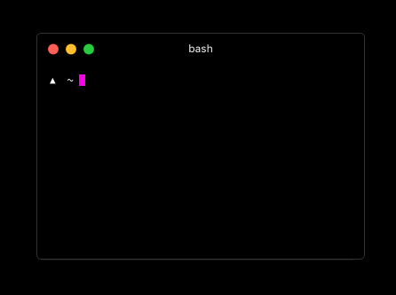

In early 2016, Windows delivered a new feature that was long awaited: The possibility of running Linux Bash.

This is possible because the module "Windows Subsystem for Linux", provides a Linux environment running within Windows 10 itself, without the need for virtual machines, working seamlessly with Windows.

## Analyzing the market

Sometimes we get the impression that very few people still use Windows for development. But I'm sure that impression is different from reality. I did a quick search on Twitter (which is quite niche) and the results were:


This shows that even among my followers, many people use Windows, and that shouldn't really be a problem.

MacBooks are very expensive and inaccessible to most people. Linux ends up generating resistance among some developers, **[but shouldn't, read this text from Jaydson](https://jaydson.com/por-que-uso-linux/)** and presents a list of incompatible software
 like the Adobe package.

So good old Windows turns out to be an alternative and I think it's important that it's evolving.

## Impressions about Bash on Ubuntu

I did some tests as soon as the functionality was released, still in 2016. But it was still beta and still had many problems, mainly to find Windows folders, in addition to compatibility with some _libs_.

Some time later I started using macOS and I didn't play with Windows for a long time. But these days, almost two years later, I went back to testing _Bash on Ubuntu_ and to my surprise, it's working perfectly.

## Let's go what matters

The only point here is that for everything to work you need to have * Windows 10 * with all updates installed.

I have * Windows 10 * running on a virtual machine inside the Mac, so all prints will be in English.

### Enabling Bash on Ubuntu

First of all go to the _System Settings_ and activate the * Developer Mode *


Then go to the Control Panel, click Programs and click * Turn Windows Features On or Off *. Then search for * Windows Subsystem for Linux (Beta) *, activate and restart the system.


After restarting. Search for ** bash ** and start the terminal.


In the first run you will need to accept the terms of use and then the download of _Bash on Ubuntu_ will start. When the installation is complete create your username and password and you're done!

Now just search for _Bash on Ubuntu_ to access the terminal.

## Plus

Now let's make things better. Standard Windows terminals suck and don't provide basic things like tabs or customization.

### Hyper



**[Hyper](https://hyper.is/)** is an open source terminal, very configurable, light and powerful. Do you know the best? All settings are made using HTML, CSS and JavaScript.

It has a Windows version and I strongly recommend it.

To integrate with _Bash on Ubuntu_ just access Hyper settings (you will edit directly in your default IDE), search for * shell * and add the path:

`C:\\Windows\\System32\\bash.exe`

### VSCode


It's been my main IDE for some time now, I think **[VSCode](https://code.visualstudio.com/)** is fantastic and I almost became an evangelist.

One of the coolest features of VSCode is the integrated terminal, and you can also configure it to run _Bash on Ubuntu_.

Just access the settings and search for:

`terminal.integrated.shell.windows`

Click edit, and in the right panel change to:

`"C:\\WINDOWS\\Sysnative\\bash.exe"`

## Setting up your development environment in Bash on Ubuntu

You probably already have _git_, _node_ and other development tools installed on Windows, but they will not work in Bash. It is important to note that all installations must be done within Bash on Ubuntu itself, that is, you will need to install everything again.

You will be inside a real Bash, so some commands are different from the Windows Terminal, **[see a list of these differences](https://access.redhat.com/documentation/en-US/Red_Hat_Enterprise_Linux/4/html/Step_by_Step_Guide/ap-doslinux.html)**.

The following are some commands to install two of the most essential tools today: * git * and * node *.

```bash
#### Updating apt-get
sudo apt-get update

#### Installing the essential package
sudo apt-get install -y build-essential

#### Installing zsh
sudo apt-get install zsh

#### Installing git
sudo add-apt-repository ppa: git-core / ppa
sudo apt-get update
sudo apt-get install git

#### Installing Node
curl -sL https://deb.nodesource.com/setup_7.x | sudo -E bash -
sudo apt-get install -y nodejs
```

From here you will be able to install any development dependency, always remembering not to install on Windows anymore, but within _Bash on Ubuntu_.
___

_Bash on Ubuntu_ manages to bring Windows development much closer to Linux and macOS, and is expected to evolve further in the coming years.

If you use Windows, finally, after many years you can have a more stable and comfortable environment to develop, now the sky is the limit.

If you like and know developers who use Windows, be sure to share with them.

We!