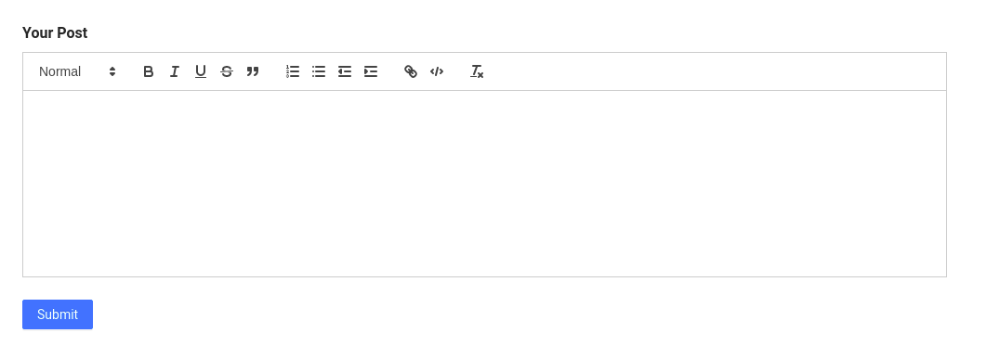

Ant design [docs](https://ant.design/docs/react/recommendation) recommends the react-quill editor as the rich text editor to be integrated with the ant design forms.

There are majorly two task to do. First one is making the React Quill Editor controlled component and second one is to integrate it with AntD forms by using values from the react-quill editor.

### Requirements :

- React project generated using `create-react-app`
- [antd](https://github.com/ant-design/ant-design) >= "^4.7.3"

First let's install [React Quill](https://github.com/zenoamaro/react-quill) package. By the time I'm writing this post it's version 1.3.5.

```bash
npm install react-quill --save
```

### Standalone React Quill Editor Component

Let's make standalone React Quill editor component so that we can reuse it again, may be while posting new post or comment.

```tsx
// TextEditor.tsx
import React from 'react';
import ReactQuill from 'react-quill';
import 'react-quill/dist/quill.snow.css';

const modules = {
  toolbar: [
    [{ header: [1, 2, false] }],
    ['bold', 'italic', 'underline', 'strike', 'blockquote'],
    [
      { list: 'ordered' },
      { list: 'bullet' },
      { indent: '-1' },
      { indent: '+1' },
    ],
    ['link', 'code'],
    ['clean'],
  ],
};

const formats = [
  'header',
  'bold',
  'italic',
  'underline',
  'strike',
  'blockquote',
  'list',
  'bullet',
  'indent',
  'link',
  'code',
];

interface OnChangeHandler {
  (e: any): void;
}

type Props = {
  value: string;
  placeholder: string;
  onChange: OnChangeHandler;
};

const TextEditor: React.FC<Props> = ({ value, onChange, placeholder }) => {
  return (
    <>
      <ReactQuill
        theme="snow"
        value={value || ''}
        modules={modules}
        formats={formats}
        onChange={onChange}
        placeholder={placeholder}
      />
    </>
  );
};

export default TextEditor;
```

We can customize the toolbar by adding the modules and toolbar array. Learn more about it [here](https://github.com/zenoamaro/react-quill#custom-toolbar).

### Integrate with Ant Design Forms

We are using the above `TextEditor` component in the component/page where we are creating the post.

```tsx
// Post.tsx
import { Button, Form, Input, Typography } from 'antd';
import TextEditor from 'components/TextEditor';
import React, { useState } from 'react';

const { Item } = Form;
const { TextArea } = Input;
const { Title } = Typography;

interface IPostCreate {
  body: string;
}

export const PostCreate = () => {
  const [form] = Form.useForm();

  const onSubmit = (values: IPostCreate) => {
    // logic to submit form to server
    console.log(values.body);
    form.resetFields();
  };
  return (
    <>
      <Title level={5}>Your Post</Title>

      <Form layout="vertical" form={form} onFinish={onSubmit}>
        <Item
          name="body"
          rules={[
            {
              required: true,
              message: 'Please enter body of post',
            },
          ]}
        >
          {/* @ts-ignore */}
          <TextEditor />
        </Item>

        <Item>
          <Button htmlType="submit" type="primary">
            Submit
          </Button>
        </Item>
      </Form>
    </>
  );
};
```

The above code is just the basic Form component taken from AntD docs. Main thing is that we are now wrapping the `TextEditor` component with the `Item` component imported from the `antd` forms. It also covers basic client side validation to check if the form field is empty or not.❓

Here, we are just logging the value of editor in the console, in real-world application we add logic to submit the form values to the server there. And finally reseting the fields using `form.resetFields()`. You can add more `<Item>` component inside the form it will get the value as usual.

The final output will look like this : 👇


That's it ! 👋

Ant Design has been my go to framework for building the React Application. I will post more tutorials on it if I find anything interesting on Ant Design.
