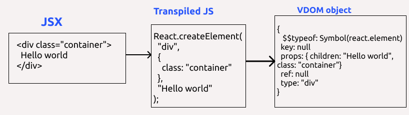
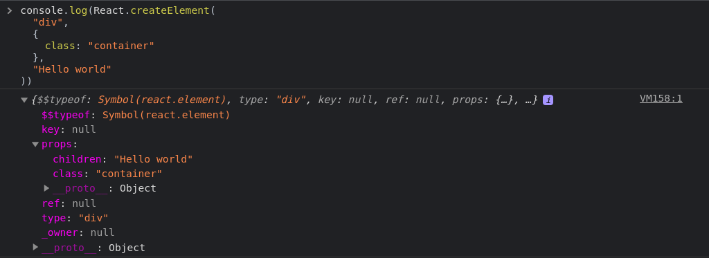
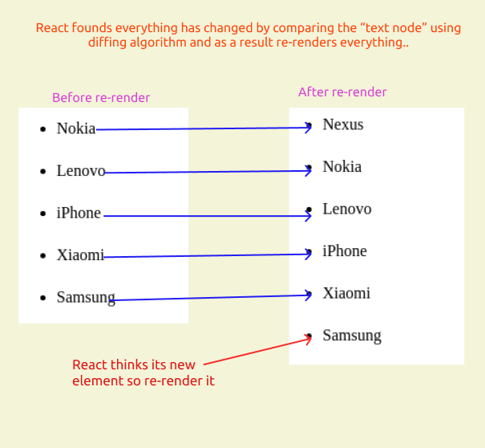

### Reconciliation and Virtual DOM

First, let's understand how React rendering process works.

**Virtual DOM :** Its a object that represents the DOM tree structure of an App in memory. Lets see how can we get from JSX to Virtual DOM :



Basically when you write JSX, it gets transpiled to plain old js by Babel or other compiler. It invokes the `React.createElement()`function which bunch of parameteres as per your element and the plain old JS object which is also known as `Virtual DOM`.



But...
Most of our application isn't only about the static content. What happens when the state changes and we have to generate new UI based on that state.

When the states changes, react generate the entire new object or VDOM tree. It is really cheap to generate these objects, React does it super fast. Generating such objects 100 times is cheaper operation rather than perfoorming the single DOM node operation.

_Remember it only generates the VDOM object not render it to the real DOM._

React now diffs the newly generated VDOM tree with previous tree aka JavaScirpt object which is also known as diffing algorithm, and find out what things have changed after state update. However, while rendering those updates to DOM, it doesn't render the entire tree (which is costly in terms of performance), instead it follows the [certain guideles](https://reactjs.org/docs/reconciliation.html#motivation) which makes the React extremly fast in terms of performance.

These bunch of optimizations technique are nothing, but part of process called Reoncilation.

### Back to topic

One of the key points of Reconcilation algorithm is :

> Diffing of lists is performed using keys. Keys should be "stable, predictable, and unique."

Lets see an example of e-commerce app where we have thousands of items and they are fetched from backend and mapped in the frontend.

Here's the example sandbox if you want to playaround with it.

https://codesandbox.io/s/funny-sea-99520?file=/src/App.js

So, when we click on the button it adds the new item in the list. Lets see what items do get rendered when we add the new items in the list.


If you notice carefully on `devtools` each time we add the new items on the top of list, then the whole items below it gets re-render.
Remember our diffing should only result in the newly added item and only should re-render that item on DOM.

```js
var updatedTree = diff(oldListTree, newListTree);
```

This is the toy app, so you mightn't even notice the perforamnce issues. But
imagine the same scenario in the large e-commerce application, where we have live polling of data and other things going on it can be really really expensive. We can't generate the every items in the list every new item is rendered, that will be really bad UX !!

### So, whats the problem ?


When we add the new mobile on the top of list, React only sees the text content in the first item in the list and notices that `Nokia` element changes to `Nexus` then re-render it.... similarly it looks at second element and founds `Lenovo` changed to `Sony` and re-render it....
This goes till the last util whole item below it gets re-rendered. Remember I say it only looks at the text node not anything else.

So, that brings to another point of reconcilation :

> Every DOM node is associated to the element, If that element changes then the DOM node
> changes. If the element is destroyed that DOM node is gonna be destroyed.

In our case if Mobile item gets changed then its corresponding DOM node will also get changed.



_The thing with list of elemnents in virtual DOM is that element push or pop at the end by default so you mightn't notice any re-render if you push item at end._

### Solution

Sooooo, what's the solution of problem ? Most of you have already guessed it it's using `key`
prop in every item in the list.

Infact React itself gives ncie warning to have the key prop on every item in the list:

```
Warning: Each child in a list should have a unique "key" prop.
```

Above code can be refactored as :

```jsx
<ul className="list">
  {items.map(item => {
    return <li key={item.id}>{item.name}</li>;
  })}
</ul>
```


If you notice on devtools only one the item which has been added to the top gets re-rendered on every item, other one stays as usual.

So, what's the magic `key` props bring to you component ?

Keys are the hacky way to tell React what makes the **item** in the list, same **item** between the renders.
So if we pre-prend item on the beginning of the list, with key attribute, then while diffing : React loops over the list in VDOM and checks the first item `Nokia`, see its `key = {1}` then compares with the new VDOM tree first item `Sony` has `key={104}` it's different. But, wait a minute.... Let's loop at another item and sees its key, and found `key={1}` and found that it matches ! It continues to loop all the items in the lists and finds what has actually changed after re-render.


which agains brings back to our old formula :

```js
var updatedTree = diff(oldListTree, newListTree);
```

and finds updatedTree has only item changed that is `Sony` and only that item `Sony` will get rendered on the DOM.

The makes React application really really fast, especially in those complex UI where multiple things are going at once.

If you notice that ue use `id` property of item obj which is unique. We make to make sure that every item key in the list should be unique. This makes sure that even in the re-render the state of the list doesn't change as React looks for `key` value as the way to diff the lists.

### What should be key of items ?

Normally when you have list of items fetching from api, then it is most likely that unique id has been created at the time of creating the data. So, that will be the best approach since, every id during creation of data will be unique.

Besides, there are other packages like [nanoid](https://www.npmjs.com/package/nanoid) which I personally use.

But, never pass the `index` of item as `key` attribute !

```jsx
<ul className="list">
  {items.map((item, index) => (
    <li key={index}>{item.name}</li>
  ))}
</ul>
```

The problem with this approach is it will re-render the whole list when new item is added since the key of all item will changed.

If you see any kind of mistake/typo on above post [edit it on GitHub](https://github.com/adarshaacharya/adarshaacharya.com.np/edit/master/content/posts/07-role-based-authorization-react-router-v6/index.md).

Enjoy !

Subscribe to my newsletter if you want upcoming blogs directly in your inbox. 👇
